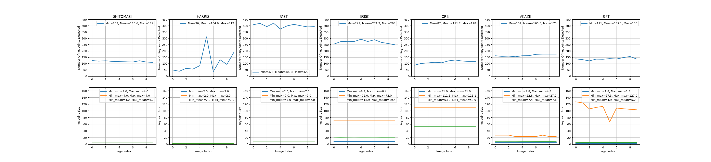
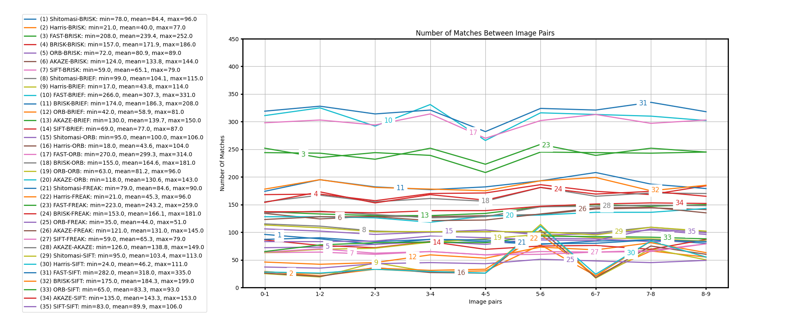

# Sensor Fusion Engineer Nanodegree 2D Feature Tracking

The purpose of this project is to test, analyze, and determine the most effective combination of available OpenCV key-point detectors, descriptors, and matching methods to estimate Time-to-Collision (TTC), a metric used by collision avoidance systems in self-driving vehicles. TTC is based on the sequence of images provided by a monoview camera mounted on top of a vehicle, forward-facing. TTC involves trade-offs between multiple factors: the number of keypoints detected, the number of matches between the consecutive images, required processing time. 

The default OpenCV implementation parameters were used for each entity (detectors, descriptors, matchers, selectors). The measurements were taken on an Ubuntu virtual box, Linux 16.04LTS.

## Results

### Keypoint Statistics

For a larger view, click the image above.

### Match Statistics

For a larger view, click the image above.

### Timing Statistics
The table below shows the average computation time in ms of all detector/descriptor combinations across the 10 input images. Detector/Descriptor pairs that are in compatible show NA for the time and are listed at the bottom of the table. Pairs are listed in ascending order w.r.t. average computation time.

| Detector  | Descriptor | Average time (ms) |
|-----------|------------|-------------------|
| FAST      | ORB        | 6                 |
| FAST      | BRIEF      | 7                 |
| FAST      | BRISK      | 8                 |
| ORB       | BRISK      | 15                |
| ORB       | ORB        | 20                |
| ORB       | BRIEF      | 22                |
| Shitomasi | BRISK      | 27                |
| Harris    | BRISK      | 27                |
| Harris    | ORB        | 28                |
| Shitomasi | BRIEF      | 29                |
| Harris    | BRIEF      | 29                |
| Shitomasi | ORB        | 37                |
| BRISK     | BRIEF      | 45                |
| BRISK     | BRISK      | 47                |
| BRISK     | ORB        | 51                |
| Shitomasi | SIFT       | 56                |
| FAST      | FREAK      | 57                |
| Harris    | SIFT       | 59                |
| SIFT      | SIFT       | 64                |
| ORB       | FREAK      | 72                |
| FAST      | SIFT       | 82                |
| Harris    | FREAK      | 83                |
| Shitomasi | FREAK      | 90                |
| BRISK     | FREAK      | 104               |
| BRISK     | SIFT       | 139               |
| AKAZE     | BRISK      | 141               |
| ORB       | SIFT       | 143               |
| AKAZE     | ORB        | 161               |
| AKAZE     | BRIEF      | 163               |
| SIFT      | BRISK      | 185               |
| AKAZE     | FREAK      | 218               |
| AKAZE     | SIFT       | 235               |
| SIFT      | BRIEF      | 245               |
| SIFT      | FREAK      | 255               |
| AKAZE     | AKAZE      | 291               |
| SIFT      | ORB        | NA                |
| Shitomasi | AKAZE      | NA                |
| Harris    | AKAZE      | NA                |
| FAST      | AKAZE      | NA                |
| BRISK     | AKAZE      | NA                |
| ORB       | AKAZE      | NA                |
| SIFT      | AKAZE      | NA                |

## Trade-off Analysis

### 1. Number of Keypoints
The table below shows the keypoint detectors sorted in descending order, based on the mean number of keypoints identified among 10 images from the monocamera video sequence. On the upper end, FAST detected a mean number of 400 keypoints in the image set, while at the low end, the HARRIS method detected only 104 keypoints, on average.  

| FAST  | BRISK | AKAZE | SIFT | SHITOMASI | ORB | HARRIS |
|-------|-------|-------|------|-----------|-----|--------|
| 400   | 271   | 166   | 137  | 117       | 111 | 104    |

### 2. Number of Matches
Below is a list of TOP-3 combinations of detector+descriptor sorted in descending order based on the mean number of identified matches among 9 pairs of 10 consecutive images. This information is based on data from [Match Statistics](#match-statistics).   

| Place     | Combination(s)                                                            |  
|-----------|---------------------------------------------------------------------------|  
| 1st (308) | FAST+SIFT, FAST+ORB, FAST+BRIF                                            |  
| 2nd (241) | FAST+BRISK, FAST+FREAK                                                    |  
| 3rd (175) | BRISK+BRISK, BRISK+BRIEF, BRISK+ORB, BRISK+FREAK, BRISK+SIFT              |  

### 3. Timing
Below is a list of TOP-3 detector/descriptor combinations sorted in descending order based on the  timing data presented in the section [Timings Statistics](#Timing-Statistics).   

| Place      | Combination(s)       |  
|------------|----------------------|  
| 1st (6 ms) | FAST+ORB             |  
| 2nd (7 ms) | FAST+BRIEF           |  
| 3rd (8 ms) | FAST+BRISK           |   

## Summary
Based on the average time taken across all images, the three detector/descriptor combinations with the lowest computation time are: FAST/ORB at about 6ms, FAST/BRIEF at about 7ms, and FAST/BRISK at about 8ms. If only speed is to be considered, these three detector/descriptor combinations would be the best for detecting keypoints on vehicles.

# Installation

## Dependencies for Running Locally
* cmake >= 2.8
  * All OSes: [click here for installation instructions](https://cmake.org/install/)
* make >= 4.1 (Linux, Mac), 3.81 (Windows)
  * Linux: make is installed by default on most Linux distros
  * Mac: [install Xcode command line tools to get make](https://developer.apple.com/xcode/features/)
  * Windows: [Click here for installation instructions](http://gnuwin32.sourceforge.net/packages/make.htm)
* OpenCV >= 4.1
  * This must be compiled from source using the `-D OPENCV_ENABLE_NONFREE=ON` cmake flag for testing the SIFT and SURF detectors.
  * The OpenCV 4.1.0 source code can be found [here](https://github.com/opencv/opencv/tree/4.1.0)
* gcc/g++ >= 5.4
  * Linux: gcc / g++ is installed by default on most Linux distros
  * Mac: same deal as make - [install Xcode command line tools](https://developer.apple.com/xcode/features/)
  * Windows: recommend using [MinGW](http://www.mingw.org/)

## Basic Build Instructions

1. Clone this repo.
2. Make a build directory in the top level directory: `mkdir build && cd build`
3. Compile: `cmake .. && make`
4. Run it: `./2D_feature_tracking`.